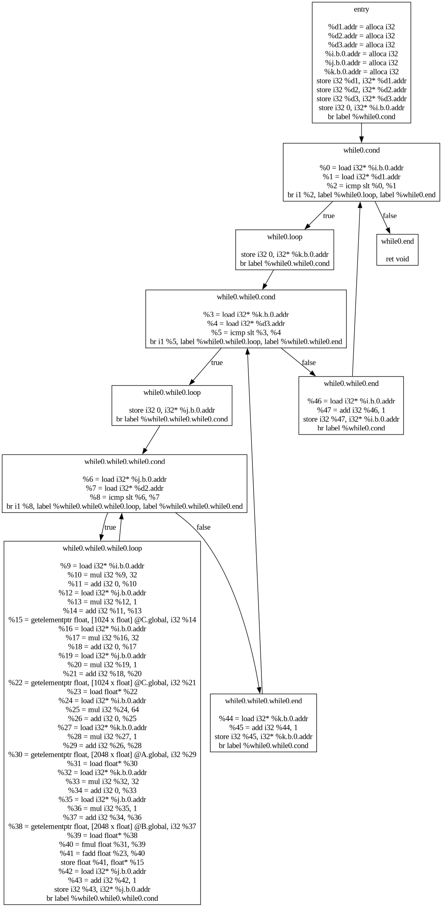
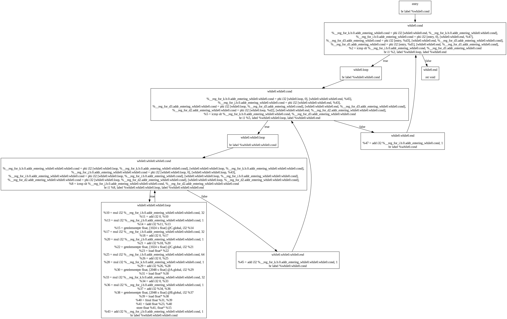
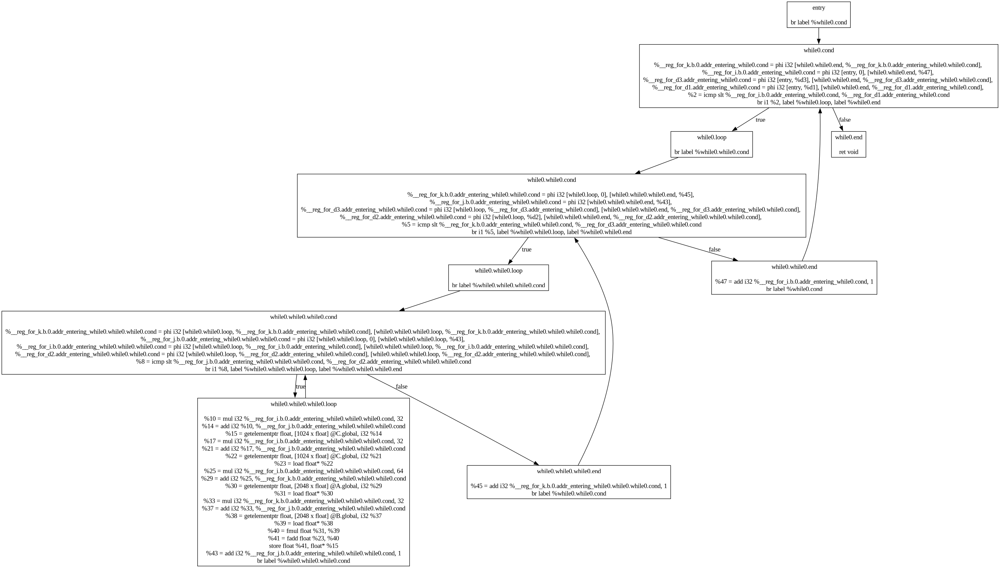

# 编译原理研讨课第三次实验报告

### 成员：王琦琪 胡贤哲 李彦辰

## 0. 本项目完成任务

编译构建所有CMake目标，可以在`cact-rie`目录下看到生成的可执行文件`cact-rie`。该可执行文件为CACT语言前端，将CACT代码翻译为LLVM代码。在chiisai-llvm目录下可以看到可执行文件rv64i，该可执行文件为LLVM-IR到RV64汇编的翻译器。

本报告将分为代码实现和优化分析两部分阐述。

## 1. 项目结构与关键代码实现

与第二次实验的项目结构几乎一致。在`include/chiisai-llvm/backend/riscv`与`src/backend/riscv`目录下，我们存放了新的RV32后端代码。下面请看详细介绍。

### 项目架构

本次实验采用了模块化设计，主要包含以下几个核心模块：

```
CactRie/
├── cact-front-end/          # 前端：词法语法分析、语义分析、IR生成
├── cact-rie/               # 编译器驱动程序
├── chiisai-llvm/           # 自定义LLVM-like IR系统与优化框架
└── mystl/                  # 自定义STL库
```

### 核心组件

1. **chiisai-llvm**: 自实现的轻量级LLVM-like中间表示系统
2. **优化Pass框架**: 多种中间代码优化算法实现
3. **RISC-V后端**: 目标代码生成与寄存器分配

### 优化框架设计

#### 1. Pass管理器架构

本实验实现了一个完整的优化Pass框架，支持函数级和模块级的优化：

```cpp
// 典型的Pass执行流程
SingleJumpEliminationPass().runOnFunction(*function);
PromoteMemToRegPass().runOnFunction(*function);
LoopAnalysis().runOnFunction(*function);
UselessArithEliminationPass(*llvmContext).runOnFunction(*function);
```

#### 2. 数据流分析基础

实现了完整的数据流分析框架，支持：

- 支配树构建
- 活跃性分析
- 控制流图分析
- 循环检测与分析

#### 3.关键优化算法实现

##### (1) Mem2Reg优化 (Memory-to-Register Promotion)

**核心思想**: 将内存访问转换为寄存器操作，这是最重要的优化之一。

**实现要点**:

```cpp
bool PromoteMemToRegPass::isPromotable(CRef<AllocaInst> ai) {
  // 检查alloca指令是否只被load/store使用
  for (auto user : ai->users) {
    if (isa<LoadInst>(user) || isa<StoreInst>(user))
      continue;
    return false;  // 不可提升
  }
  return true;
}
```

**优化过程**:

1. **识别可提升变量**: 只被load/store指令使用的局部变量
2. **插入φ节点**: 在汇合点插入φ指令处理多个定义
3. **重命名**: 使用SSA形式重命名变量

```cpp
void PromoteMemToRegPass::renameAllocaInBlock(
    Ref<BasicBlock> block,
    std::unordered_map<CRef<AllocaInst>, Ref<Value>> &mostRecentValue) {
  
  for (auto inst : block->instructions) {
    if (isa<StoreInst>(inst)) {
      auto si = cast<StoreInst>(inst);
      if (isa<AllocaInst>(si->pointer())) {
        auto ai = cast<AllocaInst>(si->pointer());
        mostRecentValue[ai] = si->value();  // 更新最近值
      }
    }
  }
}
```

##### (2) 无用算术消除 (Useless Arithmetic Elimination)

**优化规则**:

- `x * 0 = 0`
- `x * 1 = x`
- `x + 0 = x`
- `x - 0 = x`
- `x / 1 = x`
- `x % 1 = 0`

**实现细节**:

```cpp
void UselessArithEliminationPass::runOnFunction(Function &func) {
  bool changed = false;
  do {
    changed = false;
    for (auto &block : func.basicBlocks()) {
      for (auto inst : block.instructions) {
        if (auto binary = cast<BinaryInst>(inst)) {
          if (binary->opCode == Instruction::BinaryOps::Mul) {
            if (checkZero(binary->lhs()) || checkZero(binary->rhs())) {
              binary->replaceAllUsesWith(ctx.constant(Type::intType(ctx), "0"));
              changed = true;
            }
          }
        }
      }
    }
  } while (changed);
}
```

##### (3) 单跳转消除 (Single Jump Elimination)

**目标**: 消除只包含一条无条件跳转指令的基本块。

**算法步骤**:

1. 识别只有一条跳转指令的基本块
2. 更新前驱块的后继关系
3. 删除冗余基本块

```cpp
void SingleJumpEliminationPass::runOnFunction(Function &func) const {
  bool isChanged = false;
  do {
    isChanged = false;
    for (auto bb : func.basicBlockRefs()) {
      if (bb->instructions.size() == 1 && bb->successors.size() == 1) {
        auto jumpDest = bb->successors.front();
        // 更新前驱后继关系
        for (auto pred : bb->predecessors) {
          for (auto &succ : pred->successors) {
            if (succ == bb) succ = jumpDest;
          }
        }
        func.removeBasicBlock(bb);
        isChanged = true;
      }
    }
  } while (isChanged);
}
```

##### (4) 循环分析 (Loop Analysis)

**实现的自然循环检测算法**:

```cpp
void LoopAnalysis::runOnFunction(const Function &func) {
  DominatorTree domTree{};
  domTree.buildFromCFG(func);
  
  auto isBackEdge = [&](CRef<BasicBlock> from, CRef<BasicBlock> to) {
    return domTree.dominates(to, from);  // 支配关系判断回边
  };
  
  for (const auto &bb : func.basicBlocks()) {
    for (auto pred : bb.predecessors) {
      if (isBackEdge(pred, makeCRef(bb))) {
        // 发现循环，构建循环体
        Loop loop{makeCRef(bb)};
        findLoopBody(loop, makeCRef(bb), pred);
        loops.emplace_back(std::move(loop));
      }
    }
  }
}
```

##### (5) 常量传播 (Constant Propagation)

**数据流分析实现**:

```cpp
struct ConstantState {
  static ConstantState identity() { return ConstantState{}; }
  
  ConstantState meet(const ConstantState &other) const {
    ConstantState result{values};
    for (const auto &[key, value] : other.values) {
      if (result.values.contains(key) && result.values[key] != value)
        result.values.erase(key);  // 冲突则移除
      else
        result.values[key] = value;
    }
    return result;
  }
  
  ConstLookup values{};
};
```

### RISC-V后端实现

#### (1) 寄存器分配

**活跃性分析**:

```cpp
void LivenessAnalysisPass::runOnInstSequence() {
  // 使用工作列表算法进行活跃性分析
  std::queue<uint32_t> workList{};
  
  // 反向数据流分析
  while (!workList.empty()) {
    auto currIdx = workList.front();
    workList.pop();
    
    auto &outSet = liveSets[currIdx];
    auto inSet = outSet;
    
    // in = use + (out - def)
    forDefinedRegs(pseudoInsts.insts[currIdx], 
                   [&](const std::string &reg) { inSet.erase(reg); });
    forUsedRegs(pseudoInsts.insts[currIdx], 
                [&](const std::string &reg) { inSet.insert(reg); });
  }
}
```

**寄存器权重估算**:

```cpp
void RegisterWeightEstimationPass::runOnFunction(const Function &func) {
  loopAnalysisPass.runOnFunction(func);
  
  for (const auto &loop : loopAnalysisPass.loops)
    runOnLoop(loop);
    
  for (auto bb : func.basicBlockRefs()) {
    for (const auto &inst : pseudoInsts.at(bb)) {
      int occurrence = occurInLoop.contains(bb) ? occurInLoop.at(bb) : 0;
      forRegs(inst, [&](const std::string &reg) {
        regWeight[reg] += std::pow(kLoopWeightEstimation, occurrence);
      });
    }
  }
}
```

#### (2) 函数调用约定

**ABI信息管理**:

```cpp
void FunctionABIInfo::runOnFunction(const Function &func) {
  for (auto i = 0; i < func.args().size(); i++) {
    if (auto arg = func.args()[i];
        arg->type()->isInteger() || arg->type()->isConvertibleToPointer()) {
      if (numIntArgRegUsed(func.name()) < kMaximumIntegerArgumentRegisters) {
        integerArgReg[func.name()].emplace_back(i);
      } else {
        argsOnStack[func.name()].emplace_back(i);
      }
    }
  }
}
```

### 编译器驱动程序

主程序实现了完整的编译流程：

```cpp
int compileToLLVM(const std::filesystem::path &file, const std::filesystem::path &output) {
  // 1. 词法语法分析
  antlr4::ANTLRInputStream input(stream);
  cactfrontend::CactLexer lexer(&input);
  cactfrontend::CactParser parser(&tokens);
  
  // 2. 语义分析
  auto symbolRegistrationVisitor = cactfrontend::SymbolRegistrationVisitor();
  symbolRegistrationVisitor.visit(tree);
  
  // 3. 常量求值
  auto constEvalVisitor = cactfrontend::ConstEvalVisitor(symbolRegistrationVisitor.registry);
  constEvalVisitor.visit(tree);
  
  // 4. IR生成
  auto llvmIRGenerator = cactfrontend::LLVMIRGenerator(irCodeStream, srcFileName, 
                                                       symbolRegistrationVisitor.registry);
  llvmIRGenerator.visit(tree);
  
  // 5. 格式化输出
  auto irFormatter = cactfrontend::LLVMIRFormatter();
  irFormatter.format(irCodeStream);
  
  return 0;
}
```

### 优化效果分析

#### (1) Mem2Reg优化效果

**优化前**:

```llvm
%1 = alloca i32
store i32 42, i32* %1
%2 = load i32, i32* %1
%3 = add i32 %2, 1
```

**优化后**:

```llvm
%2 = i32 42
%3 = add i32 %2, 1
```

消除了内存分配和访问，直接使用寄存器。

#### (2) 无用算术消除效果

**优化前**:

```llvm
%1 = mul i32 %x, 0
%2 = add i32 %y, 0
%3 = div i32 %z, 1
```

**优化后**:

```llvm
%1 = i32 0
%2 = i32 %y
%3 = i32 %z
```

#### (3)控制流简化

**优化前**:

```
BB1:
  br BB2
BB2:
  %x = add i32 1, 2
  br BB3
```

**优化后**:

```
BB1:
  %x = add i32 1, 2
  br BB3
```


## 2. 中端优化及分析

### 2.1. 中端优化

在中端，我们实现了一个简单的$mem2reg$优化，将SSA形式的IR中的内存操作转换为寄存器操作。

此外，我们实现了一个简单的Pass，将中端中冗余的基本块（只有一个跳转指令）简化掉。

我们还实现了循环的分析。具体来说，构建函数的控制流图后，在其控制流图上运行支配树的构建。有了支配树之后，我们可以检查支配树中所有的“回边”，即从某个节点到其支配节点的边，这个支配节点就是循环的头节点，而这个回边的起点被称为$latch$。从循环头节点到$latch$的所有路径上，所有被循环头支配的节点便是循环体的节点。依此，我们便找出了循环的所有节点。

虽然关于循环的优化有很多，但是经过我们的研究发现，这些优化大多都需要构建循环嵌套树，更关键的是往往需要对循环形式进行变换，考虑到我们的时间和精力，我们没有实现这些优化。然而，循环分析可以为寄存器分配提供指导。

我们试图按照SSA book中提到的“稀疏数据流分析”方法设计一个数据流分析框架进行中端优化，遗憾的是由于我们在研究循环优化上花了太多时间，直到截止之前我们未能完成这个框架。

### 2.2. 中端优化及分析结果

相关的pass代码都在`include/chiisai-llvm/passes`与`src/passes`目录下。

以下是一个简单的矩阵乘法的LLVM IR控制流图：



首先运行一个pass，将冗余的基本块简化掉，然后运行mem2reg pass，将能够提升的内存操作转换为寄存器操作，得到如下的控制流图：



可以看到我们干掉了所有的alloca，全部提升至寄存器，大量减少了load和store指令。

注意到这里面有很多乘以1或者加上0的无用操作，接着我们运行一个pass，将这些无用操作简化掉，得到如下的控制流图：



又减少了临时变量的使用。

接下来我们看循环分析的结果。chiisai-llvm中所有的分析与变换pass都会输出一个日志，帮助我们高效调试，同时也能帮助我们理解工作过程。循环分析产生的日志如下：

```

[info]: <<<<<<<<<<<<<<<<<<<<<< Loop Analysis For matrix_multiply >>>>>>>>>>>>>>>>>>>>>>
[info]: checking block: entry
[info]: checking block: while0.cond
[info]: found loop header: while0.cond, back edge : while0.while0.end -> while0.cond
[info]: block while0.while0.end is dominated by loop header while0.cond, and can reach while0.while0.end, add to loop body
[info]: block while0.while0.cond is dominated by loop header while0.cond, and can reach while0.while0.end, add to loop body
[info]: block while0.loop is dominated by loop header while0.cond, and can reach while0.while0.end, add to loop body
[info]: block while0.while0.while0.end is dominated by loop header while0.cond, and can reach while0.while0.end, add to loop body
[info]: block while0.while0.while0.cond is dominated by loop header while0.cond, and can reach while0.while0.end, add to loop body
[info]: block while0.while0.loop is dominated by loop header while0.cond, and can reach while0.while0.end, add to loop body
[info]: block while0.while0.while0.loop is dominated by loop header while0.cond, and can reach while0.while0.end, add to loop body
[info]: checking block: while0.loop
[info]: checking block: while0.while0.cond
[info]: found loop header: while0.while0.cond, back edge : while0.while0.while0.end -> while0.while0.cond
[info]: block while0.while0.while0.end is dominated by loop header while0.while0.cond, and can reach while0.while0.while0.end, add to loop body
[info]: block while0.while0.while0.cond is dominated by loop header while0.while0.cond, and can reach while0.while0.while0.end, add to loop body
[info]: block while0.while0.loop is dominated by loop header while0.while0.cond, and can reach while0.while0.while0.end, add to loop body
[info]: block while0.while0.while0.loop is dominated by loop header while0.while0.cond, and can reach while0.while0.while0.end, add to loop body
[info]: checking block: while0.while0.loop
[info]: checking block: while0.while0.while0.cond
[info]: found loop header: while0.while0.while0.cond, back edge : while0.while0.while0.loop -> while0.while0.while0.cond
[info]: block while0.while0.while0.loop is dominated by loop header while0.while0.while0.cond, and can reach while0.while0.while0.loop, add to loop body
[info]: checking block: while0.while0.while0.loop
[info]: checking block: while0.while0.while0.end
[info]: checking block: while0.while0.end
[info]: checking block: while0.end
[info]: loop header: while0.cond, body: while0.while0.while0.loop while0.while0.loop while0.while0.while0.cond while0.while0.while0.end while0.loop while0.while0.cond while0.while0.end 
[info]: loop header: while0.while0.cond, body: while0.while0.while0.loop while0.while0.loop while0.while0.while0.cond while0.while0.while0.end 
[info]: loop header: while0.while0.while0.cond, body: while0.while0.while0.loop 
[info]: <<<<<<<<<<<<<<<<<<<<<< End Loop Analysis For matrix_multiply >>>>>>>>>>>>>>>>>>>>>>

```

这里非常完整地展现了循环分析是如何检查每个回边，定位循环头，并且找到循环体的。在最后也输出了我们找到的循环信息，可以看到这3个循环是嵌套的，正对应于矩阵乘法的3层循环。

## 3. 后端

LLVM IR与RV32的指令仍然有很多不同，这也是最大的一个教训： 不应该指望中端优化能够一劳永逸，也不能指望LLVM IR能解决很多的问题，必须考虑到后端本身的复杂性。我们设计了一种介于LLVM IR与RV32指令之间的“伪指令”中间表示，通过在每个前驱块末尾插入一个目标寄存器，这种表示消除了Phi指令。这也导致伪指令不是SSA形式。

即使忽略ABI的要求，Riscv和LLVM IR也有很多区别，包括：Riscv指令的跳转只能指定一个目标（解决方法是把有条件的Br指令翻译为连续的两条跳转），Riscv指令对于比较谓词的支持非常少，Riscv指令中的全局变量必须首先通过`la`指令加载地址，riscv指令支持下标偏移访存，但下标必须是立即数（解决方法是对于所有的getelementptr，我们都把它们的值算出来，然后在load/store的时候直接用0偏移），Riscv不支持两个常数同时二元运算（这种情况下我们直接把结果算出来并将其载入寄存器），等等。

除了消phi导致的情况，以及翻译条件时导致的原地取反以外，其它的情况下我们都要求指令是SSA的。这是由于我们在代码中以字符串作为唯一的标识，在寄存器分配中相同的名字必须对应于相同的寄存器，因此对于phi指令而言，即使有重名，我们也会在活跃变量分析中将其视为同一个变量，这也就能够保证保存phi指令结果的寄存器能够在寄存器分配中保持一致。而对于条件，哪怕我们在活跃变量分析中将其视为不同的变量，最终由于名字一样，计算出来的活跃区间也是没有问题的。

因此，对于翻译过程中产生的一些中间变量，我们选择一个简单的方式： 在给中间变量命名时，在变量名后加上一个单调递增的数字标识。这样就能够保证不重复。

比如，对于如下简单的LLVM IR代码：

```llvm
define i32 @main()
{
    entry:
        %a.b.0.addr = alloca double, i32 4
        %0 = getelementptr double, double* %a.b.0.addr, i32 0
        store double 0x3FF0000000000000, double* %0
        %1 = getelementptr double, double* %a.b.0.addr, i32 1
        store double 0x4000000000000000, double* %1
        %2 = getelementptr double, double* %a.b.0.addr, i32 2
        store double 0x3FA70A3D70A3D70A, double* %2
        %3 = getelementptr double, double* %a.b.0.addr, i32 3
        store double 0x0000000000000000, double* %3
        %4 = getelementptr double, double* %a.b.0.addr, i32 0
        %5 = getelementptr double, double* %a.b.0.addr, i32 2
        %6 = call double @foo(double* %4, double* %5)
        ret i32 0
}
```

我们生成了如下形式的伪指令序列：

```
%a.b.0.addr = alloca
%0 = %a.b.0.addr + 0
store 0x3FF0000000000000 0(%0)
%1 = %a.b.0.addr + 8
store 0x4000000000000000 0(%1)
%2 = %a.b.0.addr + 16
store 0x3FA70A3D70A3D70A 0(%2)
%3 = %a.b.0.addr + 24
store 0x0000000000000000 0(%3)
%4 = %a.b.0.addr + 0
%5 = %a.b.0.addr + 16
%6 = foo(%4, %5)
ret 0
```

这样更有助于我们为其生成RV64的汇编代码。

在上面的例子里有一个小细节，就是我们发现`a.b.addr.0`这个局部变量并没有被提升至寄存器，这也是目前我们的`mem2reg`做得尚不完善的地方，我们的`mem2reg`只针对单个的局部变量进行了提升，而没有对数组进行。我们尚不知道在LLVM中是否存在相关的处理，不过直觉告诉我们针对数组进行分析和变换往往涉及到指针分析，是很复杂的，因此我们选择了不去实现这个优化。

### 3.1. 寄存器分配

我们在后端实现了一个变量活跃分析，这也是为了寄存器分配做准备。活跃分析沿着逆向的CFG进行，并且使用队列进行了小小的优化。首先考虑到`ret` `store`和`call`指令都是可能有副作用的，在初始化时，我们将这些指令推入队列中。接下来从队列中取出一个指令，并对其前驱（也就是在逆向CFG中的后续）的活跃变量集合进行更新。如果能够更新，我们将前驱也加入队列中（如果已经在队列中那么只更新就行了）。活跃变量分析是许多后续操作的基础。

据说LLVM中的贪心寄存器分配算法是依据变量的“使用密度”，我们决定借鉴这种做法（但是我们没有了解过LLVM中的贪心算法具体是怎么做的）。在循环分析中我们得到了所有的循环。如果一个循环嵌套在另一个循环中，那么该循环中的所有基本块都将在外层循环中出现。据此，我们可以统计所有基本块出现于循环中的次数，这个次数就是该基本块被嵌套的层数。

我们可以统计一个变量$a$在一个基本块中被使用的次数$x$。假设所有的循环平均执行$N$次，将所有的循环都遍历一遍，如果包含$a$的一个基本块在循环中出现了$y$次，那么我们认为$a$大概的使用次数是$x \times N^y$。我们将这个次数累计，并除以$a$的活跃区间长度，得到$a$的使用密度。这个依据能够帮助我们更好地分配寄存器： 如果一个变量在循环中被频繁访问，那么我们更希望它被存储在寄存器中。

在分配寄存器的时候，首先将参数分配到$a0$到$a7$，以及$fa0$到$fa7$这些寄存器中，如果存在栈上的传参，那么我们将其视为普通的变量进行分配。稍后我们会解释为什么会对参数进行特殊处理。

在分配的时候，我们按照使用密度从大到小的顺序进行分配，如果还存在空闲的寄存器，那么我们将其分配。如果已经没有空闲的寄存器，那么我们寻找所有已经分配的寄存器，看看当前变量的活跃区间是否与之有重合，如果没有重合，那么我们可以把这个寄存器分配给当前变量。

如果所有的寄存器分配都失败了，我们试着看能不能将一个占用寄存器的参数$spill$到栈上。这是因为参数是我们在整个寄存器分配开始之前就预先分配好的，并不按照使用密度的顺序，因此将参数$spill$到栈上有可能为使用密度更高的变量空出一个寄存器。

在$spill$的时候，我们创建一个额外的$spill$槽位，将其看作一个新的寄存器。在后续变量$spill$的时候，也会试着先将其分配到已有的$spill$槽位上，如果实在没有能够分配的$spill$槽位，那么我们会创建一个新的$spill$槽位。这样可以节省栈空间。

我们之所以不把参数也作为变量一起分配，是因为如果我们将参数分配给了与ABI不一致的寄存器，那么在函数中我们首先需要将参数从原本的寄存器拷贝到正确的寄存器中，但是这个过程很有可能会导致冲突。例如如果我们将第一个参数分配给`a1`，那么我们在函数中首先需要把`a0`的值拷贝到`a1`中，但是这个过程会导致`a1`的值被覆盖。总之，我们不希望把参数分配到与ABI不一致的寄存器中，以避免不必要的麻烦。

除此以外，我们总是会预留$3$个由被调用者保存的寄存器不参与分配，这是因为我们在需要$spill$的时候，仍然需要将栈上的值加载到寄存器中，如果我们不预留任何寄存器，那么对于RV32这种访存-运算分离的指令集，我们就没办法使用栈上的$spill$变量。之所以预留$3$个寄存器，是因为在RV64中的一条指令最多使用$3$个寄存器。

我们不必特意要求$a0$寄存器分配给函数返回值，因为我们只需要在函数调用完成后将返回值从`a0`拷贝到分配的寄存器中即可。

### 3.2. 代码生成

在生成代码的时候，我们需要仔细考虑RV64的ABI，想清楚哪些寄存器需要在何时被保存，并且划分合理的栈空间。可以通过回填技术来解决这个问题，在我们函数的栈帧中，底层（高地址）存放了被调用者保存的寄存器，顶层（低地址）存放了调用者保存的寄存器，接下来是局部变量，接下来是预留给$spill$
的空间，最后是调用者保存的寄存器空间。为了简单起见，我们尽量保证在函数执行期间，除了函数调用以外，不去挪动栈指针。只有发生函数调用，以及发生栈传参的时候我们才会修改栈指针。

另外一个问题是，哪些寄存器是需要被保存的。对于由被调用者保存的寄存器，我们可以在每一次进行store的时候进行记录，就可以知道整个函数中有哪些被调用者保存的寄存器被使用了，可以在整个函数代码的开头和结尾加上相关的保存上下文与恢复上下文的代码。
对于调用者保存的寄存器则要更麻烦一些，这些寄存器的保存都是在函数内发生函数调用的时候进行的，这时我们可以利用之前活跃分析的结果，对于函数调用，找到调用点上的活跃变量，并利用寄存器分配的结果找到它们所使用的调用者保存的寄存器，就知道“在该调用点上，哪些调用者保存的寄存器是仍在使用的”，从而精确地知道应该保存哪些寄存器。

除此以外，我们在寄存器分配的时候预留的$3$个临时通用寄存器和$3$个临时浮点寄存器也可能因为被使用而需要保存，这非常简单，只要把指令序列扫一遍，模拟生成汇编时寄存器的使用，就可以得知哪些临时寄存器需要被保存。

代码生成的过程中接下来就是一系列杂七杂八的特判了，比如对于`move`伪指令，如果一个被$spill$而另一个没有，可以优化成一个单独的`store/load`，诸如此类的优化。我甚至怀疑这种不起眼的小trick会比一些简单的中端优化更为直接有效。

## 4.总结

本次编译原理实验圆满结束，我和我的小组队友都收获颇丰。我们完成了一个完整的编译器后端系统开发，实现了从CACT语言到RISC-V汇编的完整编译流程。通过构建自定义的`chiisai-llvm`中间表示系统，实现了包括Mem2Reg优化、无用算术消除、单跳转消除、循环分析和常量传播在内的五种核心优化算法，以及基于活跃性分析的寄存器分配策略。实验过程中深入理解了现代编译器的优化原理，掌握了SSA形式转换、支配树构建、数据流分析等关键技术。

